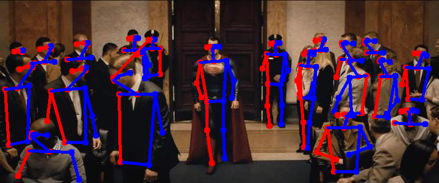
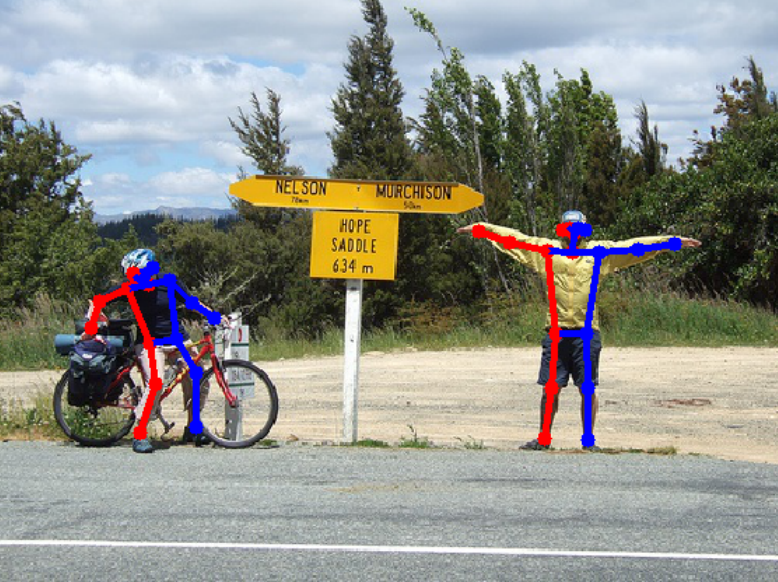

## FastPose
FastPose is a small and fast multi-person pose estimator which use middle point to do the keypoint grouping. It is the 46% smaller and 47% faster (forward time) than [OpenPose]( https://github.com/CMU-Perceptual-Computing-Lab/openpose) (without using existing model compression and acceleration methods like MobileNet, Quantization, etc). For more detail, please refer to the [technical report]( https://github.com/ZexinChen/FastPose/blob/master/FastPose_technicalReport.pdf). 

## Installation

1. Get the code.
  ```Shell
  git clone https://github.com/ZexinChen/FastPose.git
  ```

2. Install [pytorch 0.4.0](https://github.com/pytorch/pytorch) and other dependencies.
  ```Shell
  pip install -r requirements.txt
  ```

3. Download the models manually:
 **fastpose.pth**  ([Google Drive]( https://drive.google.com/file/d/1w5lzE0YGRv6mZLRGyWPYYERO3kF79HCA/view?usp=sharing) | [Baidu pan](https://pan.baidu.com/s/1FwherKVoZwPaJTzdi4xQNw)). Place it into `./network/weights` .


## Demo
You can run the code in the `./picture_demo.ipynb` to see the demo of your own image by changing test_image path 

<div align="center">
    
</div>

<div align="center">
    
</div>

## Training
1. Prepare COCO dataset:  
  a. Download **COCO.json**  (Google Drive | [Baidu pan](https://pan.baidu.com/s/1q0S2Q3rH4wDjvb87VBw-Rg) | [Dropbox](https://www.dropbox.com/s/0sj2q24hipiiq5t/COCO.json?dl=0)). Place it into `./data/coco/` .  
  b. Download **mask.tar.gz**  ([Google Drive]( https://drive.google.com/open?id=1IFaWH-ivoDHD1fLt5IRgQBDm_08mVRJF) | [Baidu pan](https://pan.baidu.com/s/1q0S2Q3rH4wDjvb87VBw-Rg)). Untar it into `./data/coco/` .  
  c. Download COCO dataset (2014)
  ```Shell
  bash ./training/getData.sh
  ```
  The `data` folder should as followed:  
  ```Shell
  -data
     -coco
        -COCO.json
        -mask
        -annotations
        -images
           -train2014
           -val2014
  ```

2. Run the training script. The default should work fine.
  ```Shell
  CUDA_VISILBE_DIVECES=0,1 python3 train.py
  ```


## Contributors
FastPose is developed and maintained by [Zexin Chen](https://github.com/ZexinChen) and [Yuliang Xiu](https://github.com/YuliangXiu/). 
Some codes is brought from [pytorch-version OpenPose]( https://github.com/tensorboy/pytorch_Realtime_Multi-Person_Pose_Estimation). Thanks to the original authors.  


## License
FastPose is freely available for free non-commercial use, and may be redistributed under these conditions. For commercial queries, contact [Cewu Lu](http://www.mvig.org/)


